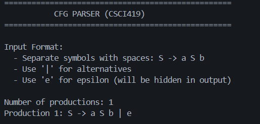
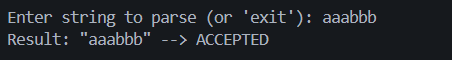
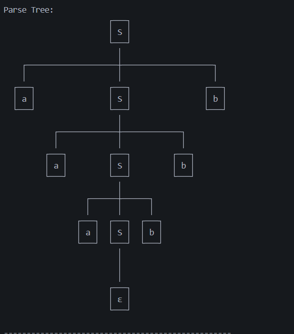
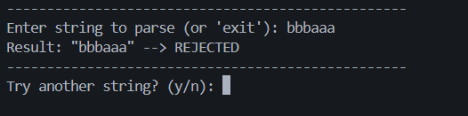

# Context-Free Grammar Parser and Parse Tree Visualizer

## Team Members
- [Name] - [ID]
- [Name] - [ID]
- [Name] - [ID]

---

# Project Description

This project is a Context-Free Grammar (CFG) parser implemented using Python. The program allows the user to enter grammar productions and test whether an input string belongs to the language generated by the grammar. If the string is valid, the parser displays derivation steps and a visual parse tree.

The parser uses recursive-descent parsing techniques and supports epsilon productions using the symbol `e`. The system also handles left-recursive grammars and visually renders parse trees using ASCII characters in the terminal.

---

# Grammar Used

```txt
S -> a S b | e
```

This grammar generates strings where the number of `a` characters equals the number of `b` characters.

Example accepted strings:

```txt
ab
aabb
aaabbb
```

---

# Input Format

Grammar productions are entered as:

```txt
S -> a S b | e
```

Example string input:

```txt
aabb
```

---

# Output Format

Accepted example:

```txt
Result: "aabb" --> ACCEPTED
```

Rejected example:

```txt
Result: "abab" --> REJECTED
```

The program also displays:
- Derivation steps
- Parse tree visualization

---

# Inside Mechanism

The grammar is stored internally using dictionaries and lists. The parser recursively processes terminals and non-terminals to validate the input string. Epsilon productions are handled using the symbol `e`.

The system constructs a parse tree during parsing using tree nodes containing symbols and child nodes. After successful parsing, the derivation sequence and parse tree are displayed in the terminal.

---

# Files Description

- `main.py` → Controls program execution
- `grammar.py` → Reads grammar productions
- `parser.py` → Contains parsing logic
- `display.py` → Displays derivation steps and parse trees

---

# Programming Language, Tools & Libraries

- Python 3
- Visual Studio Code
- Standard Python libraries only

---

# Project Screenshots

## Grammar Input


## Test String


## Parse Tree


## Rejected String


---

# Conclusion

This project demonstrates how Context-Free Grammars can be parsed using recursive-descent parsing techniques. It also visualizes derivation steps and parse trees, helping users better understand CFG parsing concepts.
